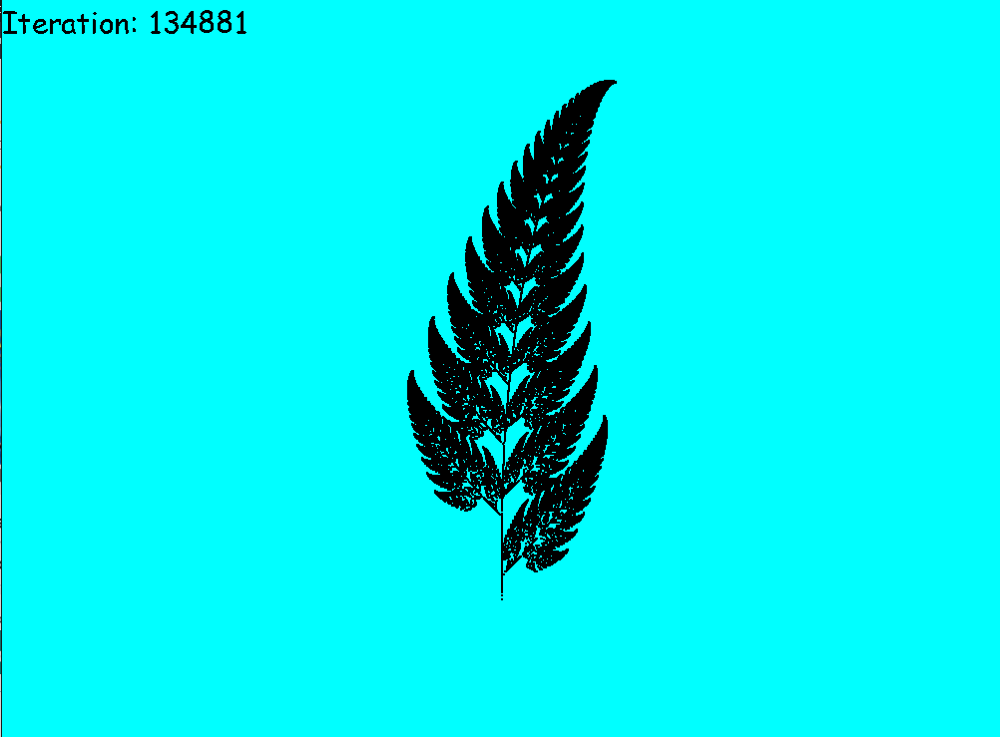

# Overview
This is a compilation of side projects inspired by Computerphile, Numberphile and fun programs written for my private Maths students.

# Modulo Circle
Beautiful circle patterns formed from modulo arithmetic.

# Barnley's Fern Fracral
A working simulation of Barnley's fern. This is a fractal pattern created using probabilty and matrix multiplication.

